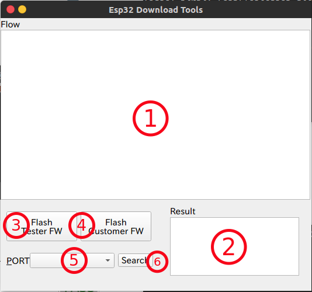
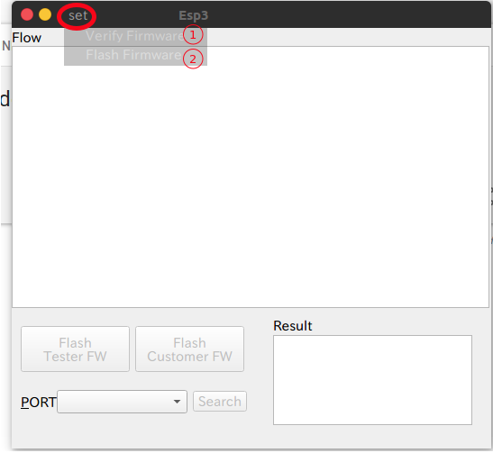
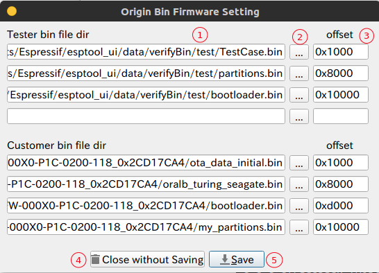
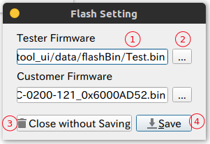

[TOC]

# ESP32 DOWNLOAD TOOL INTRODUCTION

## Windows Introduction

### Main Window

**Windows introduction:**

> 1. Terminal display (Process display)
> 2. Result display
> 3. Tester firmware flash button
> 4. Customer firmware flash button
> 5. Serial port drop-down box
> 6. Search serial port button

### Setting Windows

1. Verify Firmware Window:

   

   > 1. Bin file address display
   > 2. Choose bin file button
   > 3. Offset address edit box
   > 4. Close window and without saving
   > 5. Close window and save

   2. Flash Firmware Window:

   

   > 1. Firmware file address display
   > 2. Choose firmware file button
   > 3. Close window and without saving
   > 4. Close window and save

## How to Use and Precautions

This software is bundled with some serial port setting, as:

> 1. Baud Rate: 	115200
> 2. Data bits:       8
> 3. Flow:               None
> 4. Stop bits:       1
> 5. Parity:             None

### Usage

1. First set firmware and verify bin file
2. Click "Search" button
3. Choose one serial port to download file
4. Click "Flash" button