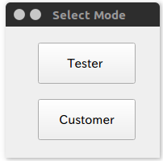
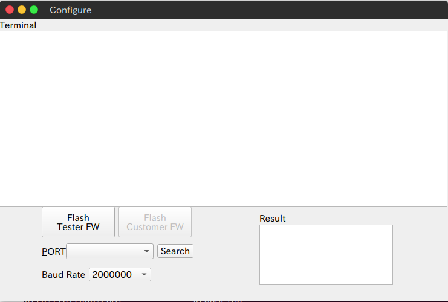
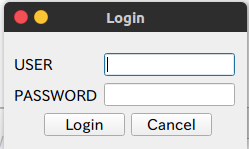
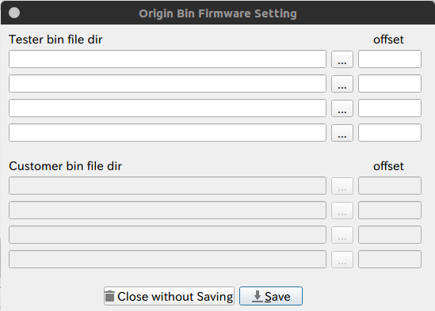
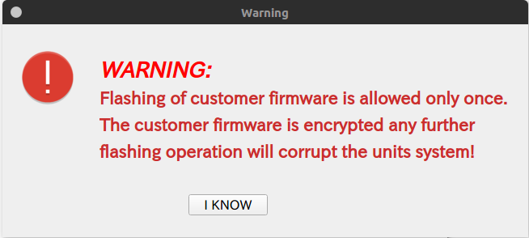
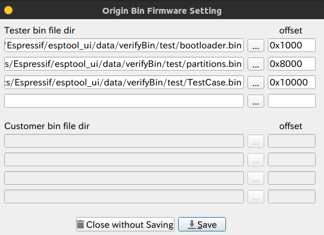
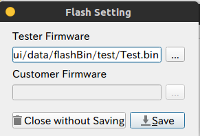
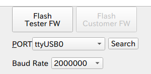
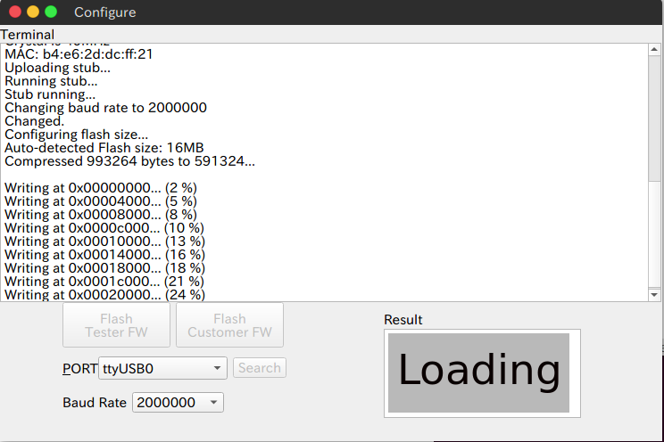

[TOC]

# ESP32 DOWNLOAD TOOL INTRODUCTION

## Windows Introduction

### Mode Window

### Main Window

#### Login Window

### Verify Configuration Window

### Flash Configuration Window

### Customer Mode Warning Window

## How to Use

1. Select 'Tester' mode
   
2. Click 'Configure' - 'Login' to login and edit configuration
   
3. Click 'Configure' - 'Verify Firmware'
4. Click '...' button to set bin file address and fill in 'offset' edit box the file's offset
5. Click 'Save' to save configuration
   
6. Click 'Configure' - 'Flash Firmware'
7. Click '...' button to set bin file address
8. Click 'Save' to save configuration
   
9. Select baud rate by 'Baud Rate' drop box 
10. Click 'Search' button to search serial port of your compute
    
11. Click 'Flash' button
    
12. The 'Customer' mode same as 'Tester' mode

